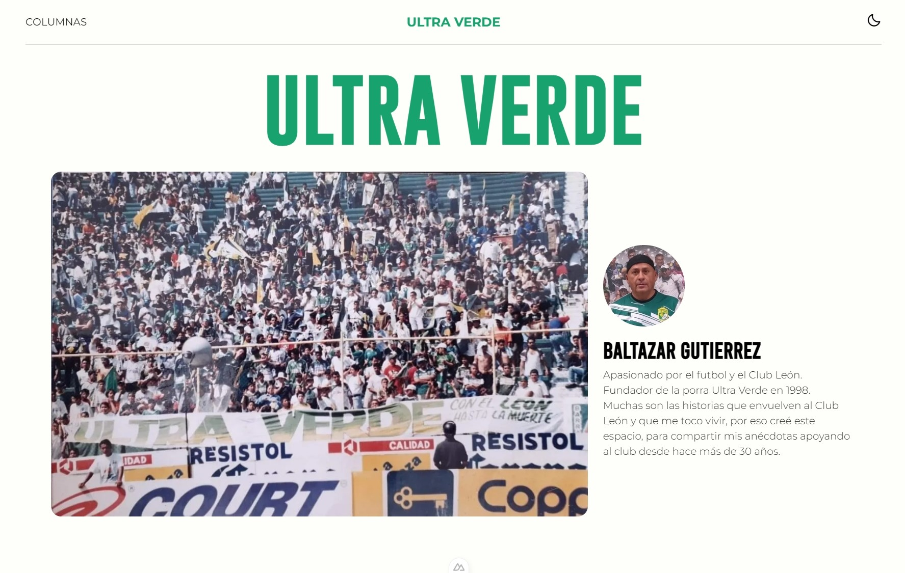

# **⚽ Ultra Verde Blog**

---

## 👨‍💻 About this project

Ultra Verde is a blog written by Baltazar Gutiérrez founder of the fans team Ultra Verde where he shares his stories supporting the Club León (team of Mexican football) for more than 40 years.

I did this project to resume my learning with Nuxt 3, a framework of Vue JS, in addition to implementing Nuxt Content with Markdown for the structure of blog.

---

---
